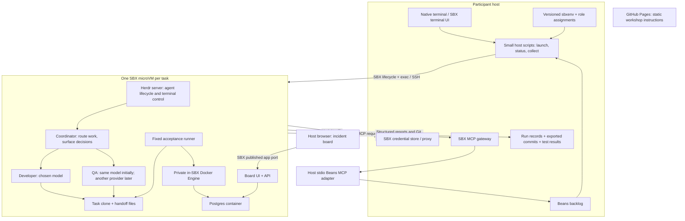

# WeAreDevelopers software factory: planning and implementation brief

Status: revised after author feedback, 2026-09-16. Confirmed: incident-triage app, GitHub Pages delivery, standalone local SBX, in-session setup, single-provider entry path, required role/provider configuration and Pi integration, with single-provider access fallback, lightweight host scripts. The author accepted the overall timeline and intervention stories; concrete exercise and implementation details remain to be verified. This is a research and demo-design handoff, not approved slide content or a verified implementation. No agents, sandboxes, credentials, or policies were started or changed during planning.

## Session contract

**Published title:** Docker's Agentic Platform: Sandboxes, MCP, and the Infrastructure of Autonomous Development.

**Speaker:** Oleg Šelajev. **Slot:** Wednesday 23 September 2026, 15:45-17:45, Stage 8, WeAreDevelopers World Congress North America. [Session page](https://www.wearedevelopers.com/world-congress-north-america/agenda/sessions/docker-s-agentic-platform-sandboxes-mcp-and-the-infrastructure-of-autonomous-dev-1308384).

**Working thesis:** You can build a useful software factory from Docker's execution and access-control components when tasks, agent handoffs, and verification have explicit contracts.

Preserve the published title, but explain the scope at the beginning: participants are assembling a platform from technologies. Do not present this workshop repository as a released Docker Agentic Platform product. Do not repeat the abstract's absolute “without risk” claim: writable workspaces, permitted services, and tools remain meaningful access.

The audience leaves with a real, locally runnable factory: lightweight host scripts and a backlog, an isolated agent team, versioned instructions, a reviewed code change, test evidence, and the ability to submit another task. A normal GitHub Pages website supplies the instructions. Participants use their native terminals and a browser for the running app. Actual local SBX instances and actual model calls do the work. Labspace, ttyd, and Simspace are outside the current scope.

The participant path requires no Docker Desktop, host Docker Engine, host container socket, or cloud compute. Containers run on the private Docker Engine inside SBX. Interpret the author's infrastructure constraint as no host Docker runtime or provisioned Docker cloud infrastructure: SBX sign-in, model endpoints, and distribution downloads remain external dependencies and must be named in setup. Presenter cloud/governance demonstrations are separate extensions.

Assume a mixed developer audience comfortable with Git, a terminal, and an AI coding assistant. Keep infrastructure terms concrete. Installation, downloads, and authentication happen during the session. Allocate ten minutes to guided setup and start downloads immediately; continue them during the following orientation. Ten minutes is a planning target, not a guarantee for machines needing virtualization changes or a reboot.

Offer tested single-provider entry profiles. A participant chooses a supported agent/provider and initially uses the same model for every role. Everyone completes the later role-to-harness/provider/model configuration chapter. Mixed-model architecture is required; participants lacking additional model access map roles to their available provider. This is an access fallback, not an optional chapter. Pi (pi.dev) is a required open-source harness in the workshop, including a real role and message handoff. The presenter uses Pi with Google Gemini alongside Claude Code and Codex. Participants can use Pi with an available supported provider, subject to verified authentication compatibility; owning a subscription for another harness does not automatically establish Pi access.

## Narrative proposal

The audience's journey is from manually supervising one coding assistant to operating a bounded, inspectable team. Each new component answers a problem exposed by the preceding exercise.

1. **Give a worker a complete development environment.** Run the board and a database container inside SBX, publish the app port, and make a small tested change.
2. **Give the work to a team.** Introduce coordinator, developer, and QA roles through Herdr, initially using separate sessions of the same model. ACR supplies shared coding instructions; templates, kits, and the environment file make the setup reproducible.
3. **Separate the role from the model.** Change the QA assignment to another provider while keeping the task and handoff contract. Everyone configures role, harness, provider, and model separately. The presenter demonstrates Pi/Gemini, Claude Code, and Codex; participants without additional provider access map the same roles to their available provider.
4. **Operate the boundary from the host.** Use a few scripts to launch and monitor work. Inspect a real blocked operation, identify its cause, and make a scoped host-side change. Beans supports task visibility without becoming a major lesson.
5. **Step in when the team needs a decision.** Developer and QA disagree about an underspecified behavior. The sandbox coordinator reports the decision needed and pauses; the human attaches over SSH, supplies the requirement, and resumes the team.
6. **Try another task.** Reserve the last 25 minutes for experiments, completion, and presenter governance/cloud extensions.

This follows the local speaker guidance: direct technical position, inspectable artifacts, transitions caused by operational limitations, sparse dry humor, and a concrete closing action. The opening should preview a completed run and its evidence, then return to the starter checkpoint. Label the preview as a prepared run. No staged claim that agents will spontaneously make a particular mistake.

Recommended recurring visual: one architecture diagram that gains a component when the participant adds it. Use a short orientation deck to explain the target system while downloads finish. The GitHub Pages chapters carry the detailed steps.

## Target system



**Host ownership.** Beans is the authoritative backlog. Small scripts create a sandbox, record its task/base commit and role mapping, deliver the goal, show status, and gather results. The human uses the host terminal for access changes. Do not build a general scheduler or make dispatcher implementation a major exercise. Agent reports are data, never shell commands or permission grants.

**Sandbox ownership.** Herdr manages agent sessions, startup, prompt delivery, inspection, and human attachment inside SBX. File-based communication complements Herdr: agents may exchange task messages, questions, review findings, and completion reports through shared files. The author reports unreliable Codex status detection, so Herdr lifecycle status must not be the sole trigger or gate for handoffs. Use bounded polling of structured files where needed; do not add a separate messaging service. Correlate reports with task ID, attempt ID, sender, and output commit where applicable, use atomic writes, and ignore stale reports. A valid current report can advance the workflow despite an incorrect Herdr status; before sending another prompt, inspect an ambiguous session rather than assuming it is ready. Test results and review evidence remain required for acceptance. A coordinator routes work to a developer and QA, bounds correction attempts, and escalates unresolved requirements. It is not a judge that invents product decisions or overrules failing checks. Initially all three roles use separate sessions of the participant's chosen model. Later, change QA or developer to a different provider; the same-provider profile remains supported. Recommended presenter mapping: Pi/Gemini coordinator, Claude Code developer, Codex QA. This gives the open-source harness a visible messaging and coordination role through Herdr. The implementer must prove this mapping, plus Pi on at least one non-Google provider for the access fallback. Pi is an agent harness, not a message broker; Herdr provides session control; shared files are also an explicit communication and progress-reporting channel. A separate planner is unnecessary for the core exercise.

**Boundary inside the team.** Agents sharing a VM and user are collaborators, not security-isolated tenants. Same-model QA provides role separation; cross-provider QA provides another model's assessment, not a guarantee of independence or correctness. The core exercise has one writer at a time; QA reports findings without editing implementation files. Parallel feature tasks are optional later experiments, with separate sandboxes/clones and tests on their integrated result.

**Completion.** Store task ID, attempt ID, base SHA, output SHA, assigned models, exact skill revision, test exit codes, review verdict, and artifact locations. A candidate becomes ready for human acceptance only after the fixed checks pass and the review refers to that exact output SHA. The host marks the Bean complete after acceptance, not merely because Herdr reports `done`. No automatic main-branch merge is needed for the workshop.

**Control state stays outside the workspace.** Keep the host backlog, dispatcher configuration, credentials, and `sbxenv.yaml` outside all agent-writable mounts. Give the sandbox a task snapshot. Prefer an isolated clone and explicit result export. Define and test the Git bundle/patch export path early; clone mode must not be taught as automatic host synchronization. Do not expose a parent repository's control files through a shared worktree `.git` pointer.

## Concrete feature to build

Confirmed app: a small incident-triage board with a browser UI, API, and containerized database inside SBX. Reuse the existing Incident Review app only if its source is available and its dependencies fit the workshop; otherwise build a minimal fixture with seeded fictional incidents. The existing demo bundle references `demo/sample-app`, but that source was not present in the inspected `demo-source` file listing. Do not depend on an unavailable packaged copy.

**Warm-up:** implement an active-filter result count with singular/plural behavior. This demonstrates one worker and a quick verification cycle.

**Main task:** add incident assignment and resolution, including a required resolution note and a visible history. This crosses UI, API validation, persistence, and tests while remaining understandable without domain onboarding.

Supplied acceptance contract:

- An incident can be assigned and resolved through the UI; refresh preserves the result.
- An empty or whitespace-only resolution note is rejected by the API, not only the browser.
- A successful resolution records a history entry; retry behavior is explicitly specified and tested.
- Existing filtering and counts continue to work.
- Automated API checks and one browser smoke flow prove the behavior.

Recommended persistence: a Postgres container launched inside SBX. Use Testcontainers for isolated API integration-test databases if the chosen stack passes the compatibility spike; otherwise the core proof can use a container with explicit setup/teardown, with Testcontainers as an enhancement. The app database and test database must be distinct. Show the agent starting a container, running real persistence tests, and cleaning up test resources. Never mount the host Docker socket or require a host daemon.

Teach two port boundaries explicitly: a database container publishes only within the sandbox; SBX publishes the app's sandbox port to a loopback port on the participant host. Keep the database off the host-facing published-port list. If the app is itself containerized, its container-to-sandbox port mapping is an additional step. The minimal path runs the app directly in SBX and only the database in a container.

Supply test harnesses and a prebuilt template. Measure cold downloads, including database images, on conference-like networking. Keep the normal feature run short enough for the workshop; narrow to assignment plus required-note resolution if measured runtime is too long.

**Human-decision exercise:** the requirements do not state what happens when a resolved incident is reopened. Supply a clearly labelled exercise brief with developer and QA positions: preserve the resolution note as current state versus clear it while retaining history. This is a product ambiguity, not permission to waive a failing test. The coordinator writes `needs-human` with both proposals and the affected behavior, then pauses that work. The participant SSH-attaches to the same crew, chooses the requirement, and records it in a decision file. The developer implements it, QA checks it, and tests preserve the agreed behavior. Supply the disagreement as an exercise input if the models do not spontaneously disagree; never claim a scripted exchange is a live model discovery.

**Host-policy exercise:** separately block a harmless dependency/reference endpoint needed by a small task. Diagnose the policy log from the host and scope the recovery to that sandbox. An inaccessible host file is a workspace boundary, not necessarily a network-policy problem: demonstrate inspection and deliberately copy a fixture or add a narrow read-only workspace only if needed. Keep a file outside the workspace as a canary that remains inaccessible. Use the SBX terminal UI for inspection if supported by the pinned build; exact UI commands are an implementation verification item.

**Guaranteed teaching fixture:** supply a separately labelled flawed candidate that validates only in the UI. The direct API acceptance test rejects it. Use it to teach the review loop even when a live implementation is correct on its first attempt. Recovery checkpoints contain real code; they never pretend to be current agent output.

**MCP contribution:** use a small host-local stdio MCP adapter over the actual Beans backlog, delivered prebuilt so participants do not compile it. The host assigns a task ID; a gateway-enabled coding role retrieves its brief and acceptance criteria through SBX MCP, then shares them with the crew through Herdr/files. Core tools are read-only `get_task(id)` and optionally `list_tasks()`. No invented runbook service, public endpoint, host Docker, MCP OAuth, or attendee governance setup. The adapter is new workshop code, not an existing Beans MCP command. Keep the backlog unmounted and restrict the adapter to its configured workshop data. Presenter governance demonstrates a named tool denial on disposable data. See [MCP research](mcp-research.md) for verified support, illustrative registration commands, the host-process boundary, and the required live validation spike.

## Where the components enter

| Component | Responsibility in this system | Participant proof |
|---|---|---|
| SBX | Execution boundary for a task team | Identify the task clone, run tests, confirm an outside canary file is inaccessible |
| Containers inside SBX | Real database and integration-test dependencies | Start Postgres on the in-sandbox daemon; prove persistence and disposable test databases |
| Published ports | Reach the app from the host browser | Open the real UI through an explicit SBX mapping while keeping the database internal |
| Template | Cached runtime with Herdr, agent CLIs, app tools | Inspect the pinned image/tool manifest; create a fresh environment without reinstalling tools |
| Kits | Declare capabilities, setup, permissions, agent integration | Add the crew/ACR capability and inspect what it requests |
| `sbxenv.yaml` | Share project environment composition | Review the plan and reproduce a new task environment |
| Credential proxy | Route approved service credentials | Successful provider request while the agent sees only the expected sentinel; never display real secrets |
| OAuth | Host-managed login and refresh for supported integrations | Preflight the chosen account path; presenter explains the exchange using sanitized evidence |
| ACR | Version and materialize coding policy/skills | Show the declaration, resolved revision, generated instructions, and a review finding tied to a rule |
| Herdr | Start, prompt, inspect, and reattach to agents | Observe coordinator/developer/QA, then change a role's model assignment |
| Beans + host scripts | Lightweight launch and task visibility | Submit a goal, inspect status, and collect the result |
| Network policy | Enforce allowed destinations | Reproducible harmless denial, attributable policy evidence, scoped recovery |
| SBX MCP gateway | Managed path to reference tools | Actual task retrieval from host Beans used by the coding team |
| AI governance | Organization-wide controls and audit | Presenter shows permitted/denied requests and their matching audit events |
| SSH | Human-decision path | Attach to the same crew, resolve an ambiguity, and resume without restarting |
| Cloud | Alternative execution placement | Presenter runs a separate cloud profile and exports a result |
| GitHub Pages | Static, shareable instructions | Follow commands in native terminals; no local website runtime required |

ACR instructions guide agents; executable tests and platform policies enforce different properties. Do not describe the coding-policy skill as a security boundary.

## Proposed 120-minute run

| Minutes | Activity | Exit condition |
|---|---|---|
| 0-10 | Open guide, install SBX, sign in, choose one agent/provider, start downloads | Setup initiated with a visible diagnostic checklist |
| 10-18 | Short slides: finished board, architecture, access boundaries; downloads continue | Learners understand the target and the host/sandbox split |
| 18-33 | First worker, database container, app port, small tested change | Real UI reachable and tests use the in-SBX Docker Engine |
| 33-48 | Form a same-model team; inspect template, kits, ACR, and environment | Coordinator/developer/QA exchange real artifacts |
| 48-63 | Required role/harness/provider/model configuration, including Pi | Presenter uses Pi/Gemini + Claude + Codex; every learner configures roles, with one-provider fallback where needed |
| 63-78 | Small host scripts and Beans; blocked operation, policy inspection, MCP reference | Task launched and a scoped access problem diagnosed from the host |
| 78-95 | SSH into a paused crew, settle a requirement, verify and collect | Decision recorded, team resumed, reviewed feature exported |
| 95-108 | Open lab: alternate assignments, follow-up tasks, catch-up | Participants exercise their own reusable setup |
| 108-116 | Presenter governance and cloud | Observable controls and alternative execution placement |
| 116-120 | Final check and take-home next task | Working repository, result artifacts, and next-run instructions |

Agent waiting time belongs inside these blocks. Setup is explicitly in-session. Slides may overlap unattended downloads, not interactive authentication or errors. Provide separate supported-OS setup instructions and a `doctor` report distinguishing missing tools, authentication, virtualization, and connectivity. Test installation without Docker Desktop/Engine present. If a machine cannot become ready, offer pairing on a working real local sandbox and retain full standalone instructions for later; do not claim a checkpoint fixes missing virtualization or authentication.

If setup overruns, use catch-up time and shorten cloud live execution and extra governance UI detail. Protect role/provider configuration, the Pi demonstration, the runnable access fallback, containers/tests, result export, and next-task command. Do not cut the architecture chapter because some learners have only one provider. Slow providers get a real checkpoint plus a fresh small live task, with the supplied checkpoint identified honestly.

## Implementation handoff

Build two sibling repositories: `wad-factory-workshop` for the runnable factory, host backlog/MCP adapter, setup tooling, distributions, and technical runbooks; `incident-triage-board` for the app, test harness, and starter/solution fixtures. No website or polished workshop lessons in this implementation pass. Exact operational setup documentation is required now; GitHub Pages lessons follow verification. The detailed build contract is [implementation-agent-prompt.md](implementation-agent-prompt.md). Suggested ownership:

```text
wad-factory-workshop/          # repository A: host-side factory technology
  factory/                    # small host scripts
  environments/               # SBX definitions outside writable app clone
  profiles/                   # role/harness/provider/model assignments
  kits/                       # crew integration and ACR composition
  template/                   # prebuilt runtime source and build definition
  roles/                      # coordinator/developer/QA
  mcp/beans/                  # host stdio server source and binary packaging
  backlog/                    # seed Beans tasks; live state in ignored .local/
  acceptance/                 # fixed workshop verification
  checkpoints/                # pairs workshop and app revisions
  technical/                  # tested setup, run, recovery, release instructions
  presenter/                  # governance/cloud extensions
  .github/workflows/          # CI and artifact builds/releases
incident-triage-board/         # repository B: the app the agents modify
  src/                        # browser UI and API
  db/                         # schema, migrations, fictional seed
  tests/                      # app tests including in-SBX containers
  scripts/                    # app/database/test commands for inside SBX
  agents.yaml                 # versioned coding instructions via ACR
```

Proposed interface names, not existing commands: `factory doctor`, `factory submit`, `factory run`, `factory status`, `factory attach`, `factory collect`, `factory accept`, `factory clean`. Each must have clear failure output; cleanup may touch only resources recorded for that run. Preserve work until export succeeds. Do not reimplement an issue tracker or full agent framework.

Keep run bookkeeping small: task ID, sandbox, assigned roles, base/output commits, current stage, and result paths. Distinguish `blocked-access`, `needs-human`, and failure from completion. The sandbox coordinator manages the work loop; host scripts launch, observe, and collect. Retry/restart must not create another sandbox or send another prompt when the preceding action may already have succeeded. No general queue engine is required.

Development order:

1. **Compatibility spike:** prove standalone SBX installation without Desktop/host Engine, supported OS/CPU combinations, kit schema, each advertised single-provider auth path, headless Herdr, the in-SBX Docker daemon, database containers, Testcontainers if used, published app ports, and gateway setup. Produce a version matrix and measured cold-start timings.
2. **Vertical slice:** one task through host script -> sandbox -> same-model coordinator/developer/QA -> fixed verification -> Git export. Implement this before lesson prose or UI polish. Validate the advertised same-model entry profiles and include a real Pi session and message handoff before declaring the slice complete.
3. **Operations and diversity:** implement required configurable harness/provider/model assignments, Pi/Gemini + Claude/Codex presenter operation, a verified Pi non-Google path, lightweight Beans integration, block/resume, a structured human-decision request, SSH intervention, timeouts, scoped cleanup, and a narrow network-denial probe.
4. **Distribution:** add ACR and the host Beans MCP adapter; pin release artifacts; produce the environment files and a multi-architecture template.
5. **Checkpoint ladder:** prepare immutable tags for `00-setup`, `01-worker-and-containers`, `02-same-model-team`, `03-mixed-model-team`, `04-host-controls`, `05-human-intervention`, `06-complete`. Each includes a start state, small learner-owned change, verifier, expected result, and non-destructive recovery instructions. The mixed-model checkpoint also retains a working single-provider configuration. Save learner work before switching checkpoints.
6. **Presenter extensions:** independent scripts for governance and cloud. No participant path depends on presenter credentials or organization membership.
7. **Technical delivery:** create tested host setup, sandbox setup, MCP setup, run/recovery, and maintainer release runbooks. Label every command HOST or SANDBOX and state its working directory. Build the Beans adapter as downloadable versioned binaries with checksums, a scoped installer, and release automation in the workshop repository. Prepare paired checkpoint manifests across both repositories. Build no website or polished learner chapters yet; later authoring will target GitHub Pages.
8. **Rehearsal and return:** deliver measured timings, failures encountered, supported OS/architecture/auth combinations, per-run model usage or cost estimates, and recorded evidence. Then return for human-readable lesson writing and optional slides.

Supply the small host scripts. Participants inspect and use them; role configuration, capabilities, policy, and human intervention carry the teaching work. Final and intermediate versions must execute real work. Template production can use maintainer build infrastructure, but attendees download ready artifacts and need no host Docker runtime.

Implementation acceptance must cover a fresh-machine run without Desktop/host Engine, both single-provider profiles, required mixed-provider presenter operation and single-provider access fallback, API-key/OAuth paths actually advertised, in-SBX database containers, isolated integration-test data/cleanup, published UI ports, successful feature work, the deliberately faulty candidate, quota/auth failure, QA failure, blocked access, unresolved requirements and SSH resolution, interruption/resume, duplicate launch, export/fresh verification, and cleanup that preserves unrelated resources. Test a combined branch only if demonstrating concurrent feature teams.

## Reuse inventory and evidence limits

- `/Users/shelajev/ai-contrib/herdr/CREWS.md`, `kits/herdr-crew/`, `src/cli/task.rs`: existing fork-specific task lifecycle, template, role files, headless server, reporting conventions. Upstream Herdr provides the agent automation primitives; do not assume the fork's `herdr task` exists in upstream releases. The workshop can use thin scripts against those primitives.
- Existing crew puts goal-seeking orchestration inside the VM. Reuse that split with a lightweight coordinator that routes developer/QA work and escalates human decisions. Adapt the existing four-role pack to three roles rather than adding a second coordinator on the host.
- Existing crew README documents an ARM-only image, unverified full host end-to-end flow, and pending OAuth verification; its spec contains later OAuth configuration. Treat that disagreement as a verification task, not proof of either success or failure. Gemini is currently required and same-model implementer/QC assignments are rejected by the existing fork driver. The workshop profiles must explicitly support a single provider and avoid or adapt that driver constraint.
- `/Users/shelajev/ai-contrib/labspaces/labspace-sbx/`: deferred reference only. No host-side ttyd or Compose provider is needed for GitHub Pages delivery.
- `wad-demo/demo-source/`: reusable environment, clone, app serving, SSH, and presenter governance material. It is an older, smaller demo, not the multi-agent workshop. Its chess endpoint is documented offline and should not be a dependency.
- [ACR kit](https://github.com/shelajev/acr-sbx-kit): available integration for Claude Code/Codex/Cursor instructions. Pi integration is required: verify its actual instruction/skill loading and implement an explicit compatible materialization step if ACR does not directly target Pi. Do not silently omit coding policy from the coordinator. Record the chosen coding-policy repository and immutable revision during implementation.
- [Labspace starter](https://github.com/dockersamples/labspace-starter) and [Simspace](https://github.com/dockersamples/simspace): outside this version's scope. All learner success criteria require real execution.

## Current platform facts to retain

- [Standalone installation](https://docs.docker.com/ai/sandboxes/install/) requires neither Docker Desktop nor host Docker Engine; SBX sign-in and supported virtualization still apply. Use the SBX-only Linux installation path, not a convenience command that also installs Engine.
- [Isolation layers](https://docs.docker.com/ai/sandboxes/security/isolation/) place a separate Docker Engine inside the sandbox. Host-local MCP servers that launch containers would instead need a host engine, so the reference MCP service must use a no-host-Docker transport: a lightweight host stdio process or a validated in-SBX/remote service. Verify connectivity and lifecycle before selecting the final packaging.
- [Local development and ports](https://docs.docker.com/ai/sandboxes/workflows/development/) supports publishing the app's sandbox port to the host. Verify the bind address, restart behavior, and port-conflict recovery in the chosen profile.
- [`sbx env` is experimental](https://docs.docker.com/ai/sandboxes/configuration/environment-files/); keep the environment file outside writable workspaces and pin the tested CLI/schema combination.
- [Kits](https://docs.docker.com/ai/sandboxes/customize/kits/) compose sandbox capabilities. The workshop needs a curated, tested composition, not arbitrary runtime kit selection.
- [Credentials](https://docs.docker.com/ai/sandboxes/configuration/credentials/) use service bindings and supported injection/OAuth mechanisms. Validate real provider behavior rather than assuming that installing a CLI authenticates it.
- The [SBX MCP gateway](https://docs.docker.com/ai/sandboxes/mcp-gateway/) is separate from Desktop MCP Toolkit. A custom crew entrypoint must configure the relevant clients; built-in single-agent startup behavior is not automatic proof for a multi-agent kit.
- [Network policy](https://docs.docker.com/ai/sandboxes/governance/access-controls/network/) has local and organization precedence. Under active organization governance, local allow rules cannot supply permissions denied by the organization. Design the presenter segment accordingly.
- [MCP policy](https://docs.docker.com/ai/sandboxes/governance/access-controls/mcp/) governs gateway registration and requests. It does not govern arbitrary direct tool connections; network controls and exposed tools still matter.
- [Cloud](https://docs.docker.com/ai/sandboxes/cloud/) has separate state and credentials and cannot mount the local workspace. Build a distinct clone/upload/export profile; do not promise that prepending `--cloud` makes the entire local workshop portable. Current docs specify SBX 0.42.0+, while this machine reports a development build `v0.39.0-943-g8371d4617`. Feature verification is required.
- [Herdr automation](https://herdr.dev/docs/agent-automation/) lifecycle states describe terminal readiness, not task acceptance. Set timeouts; inspect before retrying a potentially delivered prompt.
- [Beans](https://github.com/hmans/beans) supplies a file-backed task tracker; small host scripts associate tasks with sandbox runs and collect evidence. Keep scheduling ambitions outside the core workshop.

## Speaker-toolkit status and next planning step

Read the presentation-creator intake/intent/architecture guidance and the local provisional rhetoric summary/design spec. These support the narrative recommendation above. The vault explicitly contains no delivered-talk history; no mastery or delivery-performance claims are made.

Formal creator generation/validation could not run: the owner reader found a stale `/home/agent/.claude/rhetoric-knowledge-vault` root, and its configured local `.venv/bin/python` failed with an Xcode interpreter lookup error. No vault state was rewritten. Repair that runtime/path through the owner workflow before generating `outline.yaml` and derived narrative/slide artifacts. This brief is not a substitute source of truth for a future deck.

Author decisions captured: incident-triage app; static GitHub Pages guide; standalone SBX with containers inside; in-session installation/authentication; one chosen provider/model for all initial roles; required role/provider configuration chapter and Pi integration, with a single-provider access fallback; small host scripts; host-side access repair; SSH for a human product decision; final 25 minutes for experimentation and presenter extensions. Pi currently documents no built-in MCP client; use Herdr session control plus file-based communication for internal coordination and an explicitly verified extension only if Pi itself must invoke MCP. A Claude/Codex role can demonstrate the gateway. Sources: https://pi.dev/ and https://github.com/earendil-works/pi. Latest delivery decision: two repositories, a prebuilt host MCP adapter (prefer release binaries from the workshop repository), and tested operational documentation now; polished lessons/site later. Remaining implementation choices include app stack, Testcontainers integration, adapter build language/release destination, and tested runtime versions. Resolve these through the vertical slice and measured rehearsal, then produce polished lessons and the short orientation deck.
